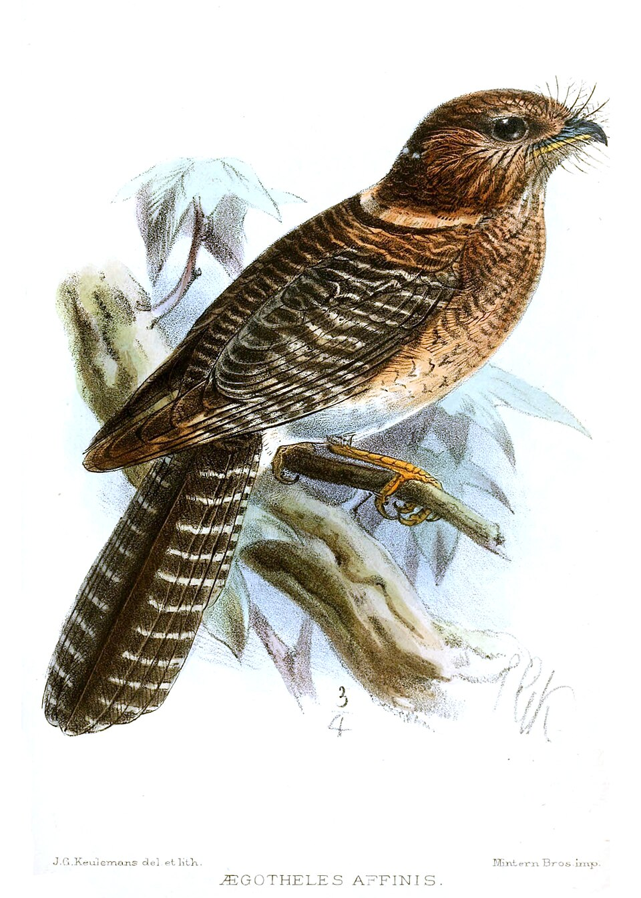

# Aves

Data, colour tokens, and images for the bird sunburst. Open the repository root and choose **Birds** (`/?group=birds`).

Current build (AviList **v2025b**, retrieved 2026-09-19): **46 orders, 252 families, 2,376 genera, 11,131 species**. Arc angle is species count, so Passeriformes dominates — that is the real shape of bird diversity.

<p>
  
  
</p>

*Left: Aegotheliformes (Keulemans). Right: Trochilidae (Haeckel). Gathered from free-licence sources; see [CREDITS.md](CREDITS.md).*

## Rebuild

From the repository root:

```bash
node Birds/scripts/build-taxonomy.mjs --include-extinct
node Birds/scripts/fetch-images.mjs
node Birds/scripts/verify.mjs
```

## Data provenance

Taxonomy comes from [AviList: The Global Avian Checklist](https://www.avilist.org/).
The build script downloads the official short workbook
(`AviList-v2025b-10Jun2026-short.xlsx`, DOI
[10.2173/avilist.v2025b](https://doi.org/10.2173/avilist.v2025b)) and records the
pinned version in `data/meta.json` and `NOTES.md`. Only species rows are kept;
subspecies and higher-rank rows are dropped.

## Image provenance

Artwork is **gathered, never generated**. Sources, in preference order: Wikimedia
Commons plates and paintings, Openverse, PhyloPic silhouettes, then a labelled
photograph fallback. Every file is listed in `CREDITS.md` with creator, licence,
and source URL.

## Licence

Code in this folder is MIT (see the repository `LICENSE`). Images keep their upstream licences.
