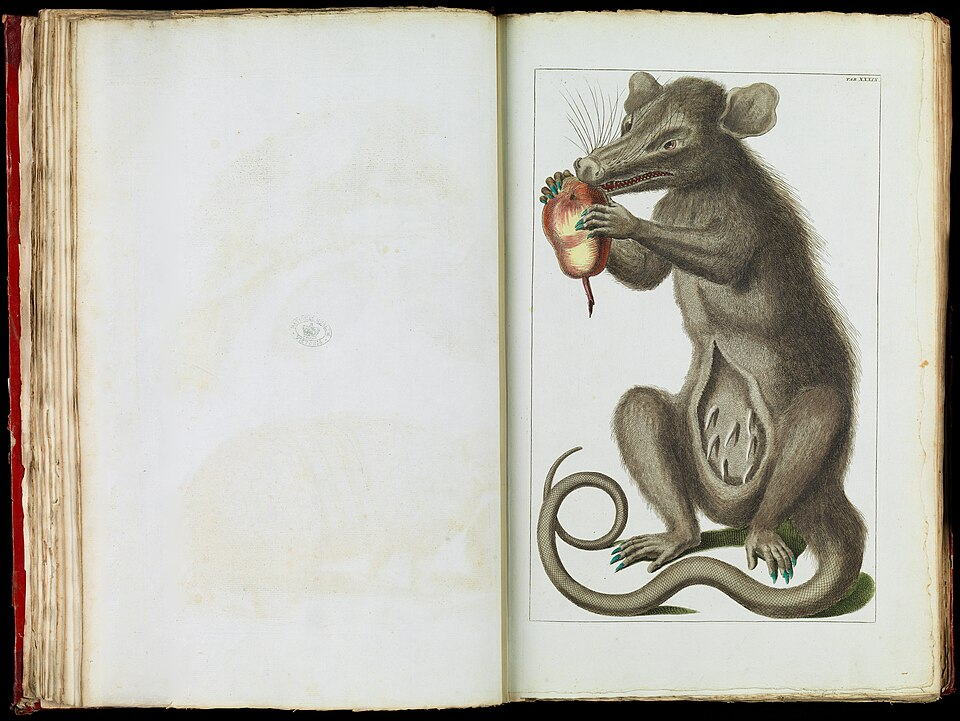

# Mammalia — a zoomable sunburst

A self-contained static chart of the mammal taxonomy: **class → order → family → genus**,
with species listed in the detail panel. The zoom model is a reimplementation of
[Mike Bostock’s Zoomable Sunburst](https://observablehq.com/@d3/zoomable-sunburst) (ISC).

Current build (MDD **v2.4**, retrieved 2026-09-19): **27 orders, 167 families,
1,360 genera, 6,871 species**. Arc angle is species count, so Rodentia and
Chiroptera dominate — that is the real shape of mammal diversity.

<p>
  
  
</p>

*Left: Carnivora (PhyloPic). Right: Didelphimorphia (Seba). Gathered from free-licence sources; see [CREDITS.md](CREDITS.md).*

Open `index.html` through a local static server (`npm run serve`). There is no bundler
and no runtime network after the first load.

## Rebuild

```bash
npm run data      # download MDD checklist, write data/*.json
npm run images    # gather free-licence taxon artwork
npm run verify    # integrity checks
npm test          # pure logic tests
npm run serve     # http://localhost:5173
```

## Data provenance

Taxonomy comes from the [ASM Mammal Diversity Database](https://www.mammaldiversity.org/).
The build script resolves the current Zenodo release from concept DOI
[10.5281/zenodo.4139722](https://doi.org/10.5281/zenodo.4139722) and records the pinned
version in `data/meta.json` and `NOTES.md`.

## Image provenance

Artwork is **gathered, never generated**. Sources, in preference order: PhyloPic,
Wikimedia Commons plates, Openverse, then a labelled photograph fallback. Every file
is listed in `CREDITS.md` with creator, licence, and source URL. Image licences are
separate from this repository’s code licence and apply per file.

## Licence

Code in this folder is MIT (see the repository `LICENSE`), except D3 (ISC) and the
Bostock zoomable-sunburst interpolation (ISC). Images keep their upstream licences.
