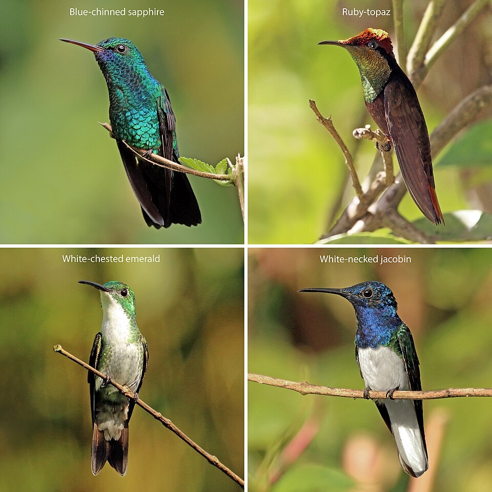

# Book of life — birds and mammals

Two self-contained zoomable sunbursts of living (and recently extinct) diversity.
Each chart is static HTML, vendored D3, and local JSON. No bundler, no runtime
network.

  
  

*Left: Carnivora (mammals). Right: Trochilidae, Haeckel plate (birds).*

| Chart | Folder | Taxonomy | Serve |
| --- | --- | --- | --- |
| [Mammalia](Mammals/README.md) | `Mammals/` | ASM Mammal Diversity Database v2.4 · 27 orders, 6,871 species | `cd Mammals && npm run serve` |
| [Aves](Birds/README.md) | `Birds/` | AviList v2025b · 46 orders, 11,131 species | `cd Birds && npm run serve` |

Click an arc to zoom in, the centre disc to zoom out. Search and `#/Order/Family/Genus`
deep links jump to a taxon. Artwork is gathered from free-licence sources (never
generated); licences are listed per file in each folder’s `CREDITS.md`.
